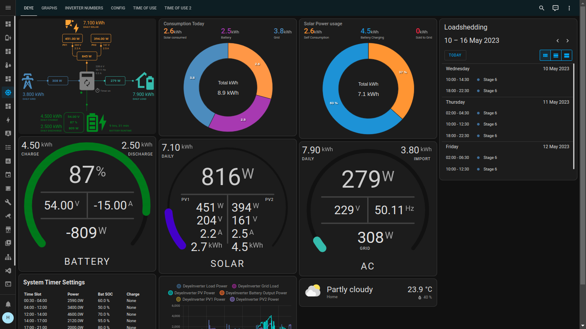
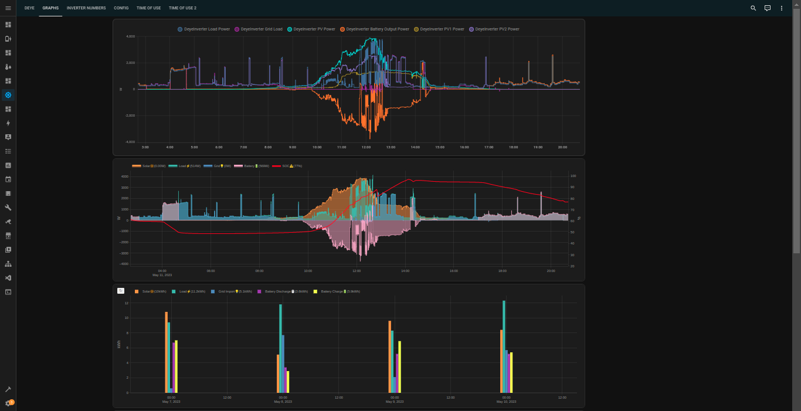
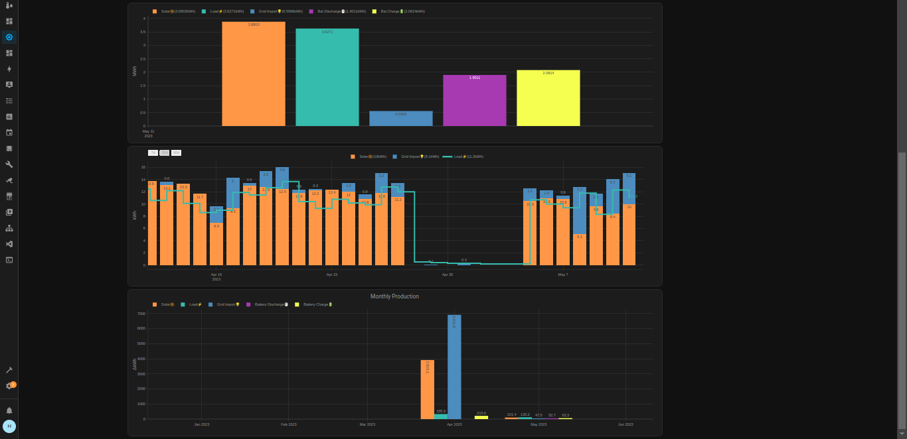
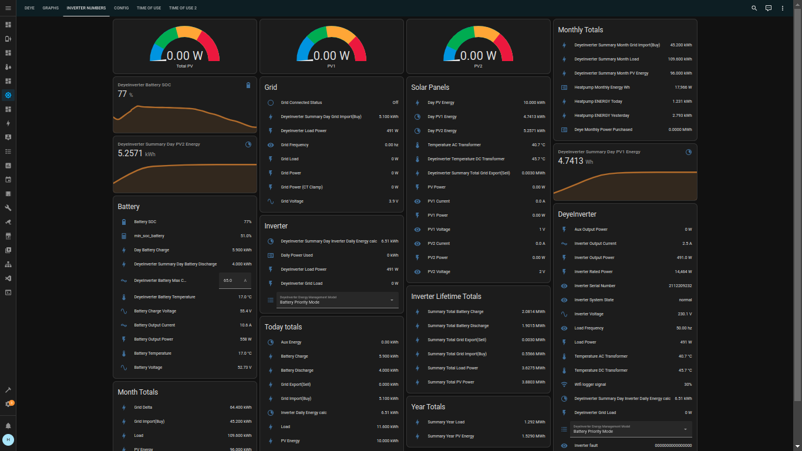
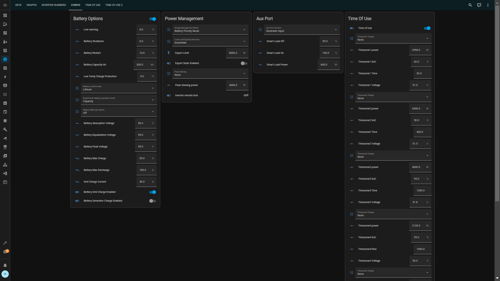
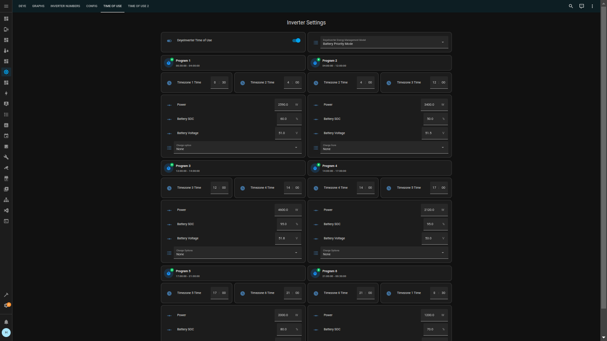
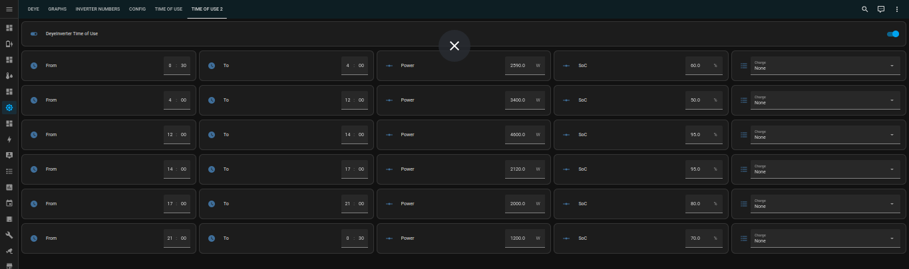
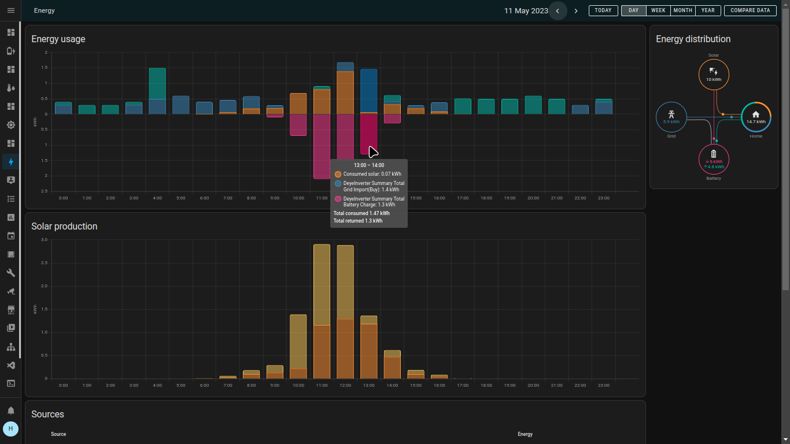

# DeyeSolarDesktop

Let's get your desktop up and running, once entities are populating with data it will look like this:

If you are new to home assistant then the DeyeSolarDesktop (Home Assistant backup file) is a quick and sure way to get your solar monitoring desktop up and running within minutes.

This desktop was built to provide a plug and play integration with the smartDeyeDongle which can be purchased seperately ~~(available towards end of June 2023)~~ Now available [SmartDeyeDongle](./SmartDeyeDongle.md) You can still use this desktop without the smartDeyeDongle [Alternative ways of fetching data](#fetching-data).

Compatible hardware: This desktop was built for Deye inverters (which includes all the rebranded inverters Sunsynk/Sol-Ark etc). There is no reason why you could not use some parts of the desktop and integrations for another inverter as many entities are similar between inverters.

The backup file contains all the home assistant plugins and integrations pre-configured to get you started plus the DeyeSolarDesktop "Solar" menu

Steps:

1. Install your own Home Assistant server  (you need an old PC/rasp pi/VM om your PC) It is opensource and free software [https://www.home-assistant.io/installation/] [Quick guide](./InstallHomeAssistant.md)
2. Restore the latest backup file in your new home assistant (found in https://github.com/tomatensaus/DeyeSolarDesktop/releases)
3. Login with user: solar password: solar123 (be sure to delete this user and create your own user)
      
   This is what the empty desktop looks like before any solar data is populated from the inverter.

4. Consult this youtube video I made describing the steps below

* Plug in your smartDeyeDongle, connect to the wifi hot-spot it provides and configure your wifi network details, once saved it will reboot and join your wifi network.
* Home Assistant will detect a new device called "DeyeInverterMaster", click "configure" and input the decryption key provided with your purchase. Your desktop will start recording data (Some parts like eg. graphs will only populate once there is enough data which might take Days/Weeks)
* Modify and delete what does not suit you, it is your desktop after all. Feel free to suggest improvements and fix any wrong values.
* Look at the various automations documented. Issues commonly reported by other users of this inverter can be fixed by various automations. Someone has already suggested the solution to your problem.
* Be sure to report any issues you find. Now optimise your power usage towards a more sustainable future and share your breakthroughs to help other people.

## I already have a running Home Assistant
In the case that you already have Home Assistant server, do not restore the backup, you will lose your existing desktop. Here is a rough guide how to copy the bits and pieces to your desktop.[JustGrabbingSomeIdeas](./JustGrabbingSomeIdeas.md)

### Fetching Data
Getting the Data from your inverter
* Preferred way is to buy the [SmartDeyeDongle](./SmartDeyeDongle.md), it plugs into your inverter and translates all the data to home assistant directly, you can expect real time data updated every 3s and the ability to change settings via the screen or automations.

* You need to buy an USB to RS485 cable and connect to your Home Assistant server, you will also need to map entities from this project as the names differ https://github.com/kellerza/sunsynk   it provides real-time data, works via MQTT

* For people with the SolarMan Dongle, it requires no additional cables to be purchased. You could pull the values from the Solarman dongle (delayed 1-10 minutes) it is not ideal for integrations that need to get updates in real time but it could work for for you if you simply want to look at the graphs https://github.com/StephanJoubert/home_assistant_solarman

* If you have a sunsynk inverter that does not have a Solarman dongle then this project might work for you as it collects the data from the sunsynk cloud service. You do not need any cable for this. https://github.com/gdwaterworth/Home-Assistant---E-Linter-Logger---Sunsynk Values are fetched from the sunsynk cloud.

### Automations and integrations to note

* Telegram integration with notifications about power outages:
see [TELEGRAM_SETUP Guide](./TELEGRAM_SETUP.md)

* New automation added:
Inverter: Switch to Export essentials/Non-Essentials when sun sets/rises
Automation is disabled (by default)
This stops the export to non-essentials from the battery when the sun is not shining, but during the day solar power is sent to non-essentials

### Why this project:
I believe that knowledge is power. Once you understand your power usage you will be able to optimise it. We are rapidly moving towards a future where there is a need to have a smart home with smart power usage. Since the platform allows automations that is the next logical step towards a greener future. If this project can enable every house to save just 5% of power sourced from dirty generation (such as coal) and replace it with power from panels already installed we have achieved our goal. Now if that saves the user money that can be seen as a bonus. Helping people to move towards a sustainable future

### Special mentions:
[https://github.com/slipx06] for sharing a large portion of the desktop and the brilliant sunsunk power flow card that shows you instantly what your inverter is doing.
