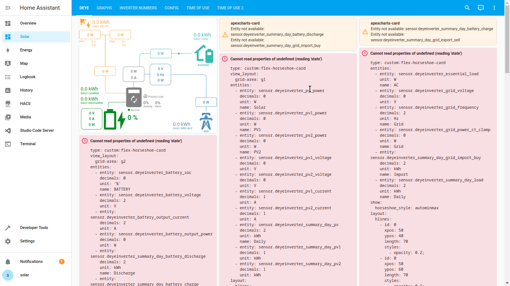

# DeyeSolarDesktop

Let's get your desktop up and running, once entities are populating with data it will look like this:

New! : Dashboard 4.5 now available see Youtube Video below for a preview.

If you are new to home assistant then the DeyeSolarDesktop is a quick and sure way to get your solar monitoring desktop up and running within minutes.

This desktop was built to provide a plug and play integration with the smartDeyeDongle which can be purchased seperately ~~(available towards end of June 2023)~~ Now available [SmartDeyeDongle](./SmartDeyeDongle.md)

Compatible hardware: This desktop was built for Deye inverters (which includes all the rebranded inverters Sunsynk/Sol-Ark/Magneeto etc). There is no reason why you could not use some parts of the desktop and integrations for another inverter as many entities are similar between inverters.

Steps:

1. Install your own Home Assistant server  (you need an old PC/rasp pi/VM om your PC) It is opensource and free software [https://www.home-assistant.io/installation/] [Quick guide](./InstallHomeAssistant.md)
2. [JustGrabbingSomeIdeas](./JustGrabbingSomeIdeas.md) Follow this guide to install the Dashboard onto your existing Home Assistant Install
3. This is what the empty desktop looks like before any solar data is populated from the inverter.
  
4. Consult this youtube video I made describing the steps to install you SmartDeyeDongle

* Plug in your smartDeyeDongle, connect to the wifi hot-spot it provides and configure your wifi network details, once saved it will reboot and join your wifi network.
* Home Assistant will detect a new device called "DeyeInverterMaster", click "configure" and input the decryption key provided with your purchase. Your desktop will start recording data (Some parts like eg. graphs will only populate once there is enough data which might take Days/Weeks)
* Modify and delete what does not suit you, it is your desktop after all. Feel free to suggest improvements and fix any wrong values.
* Look at the various automations documented. Issues commonly reported by other users of this inverter can be fixed by various automations. Someone has already suggested the solution to your problem.
* Be sure to report any issues you find. Now optimise your power usage towards a more sustainable future and share your breakthroughs to help other people.

### Fetching Data
Getting the Data from your inverter
* You can order your [SmartDeyeDongle](./SmartDeyeDongle.md), it plugs into your inverter and translates all the data to home assistant directly, you can expect real time data updated every 3-4s and the ability to change settings via the screen or automations.

### Automations and integrations to note

* Prepaid Electricty Meter [Prepaid_electricity_meter.md](./Prepaid_electricity_meter.md)
A basic dashboard to capture the current prepaid meter units remaining. It records the total grid usage of the inverter when entering the "prepaid meter units remaining" (with an automation). There is an entity that counts down the amount of units remaining. Add telegram notifications to get notified when you have X amount of units left.  

* Octopus flux [OctopusFlux_Setup.md](./OctopusFlux_Setup.md)
A complete dashboard and automation to export to the grid during peak hours and charge during cheap hours. Sit back while your inverter buys and sells power

* Import/Export Dashboard [Import/Export](./Import_Export.md)
  Automate your Deye inverter to charge the battery using the cheapest hours on the tariff for your country (for European countries with very little winter sun).

* Telegram integration with notifications about power outages:
see [TELEGRAM_SETUP Guide](./TELEGRAM_SETUP.md)

* A nice full screen dashboard with the powerflow (ideal for tablet display on a wall)
  use [solarDesktopPowerFlow.yaml](./solarDesktopPowerFlow.yaml)

* New automation added:
Inverter: Switch to Export essentials/Non-Essentials when sun sets/rises
Automation is not installed by default [packages/essentials_automation.yaml](./packages/essentials_automation.yaml)
This stops the export to non-essentials from the battery when the sun is not shining, but during the day solar power is sent to non-essentials

### Why this project:
I believe that knowledge is power. Once you understand your power usage you will be able to optimise it. We are rapidly moving towards a future where there is a need to have a smart home with smart power usage. Since the platform allows automations that is the next logical step towards a greener future. If this project can enable every house to save just 5% of power sourced from dirty generation (such as coal) and replace it with power from panels already installed we have achieved our goal. Now if that saves the user money that can be seen as a bonus. Helping people to move towards a sustainable future
