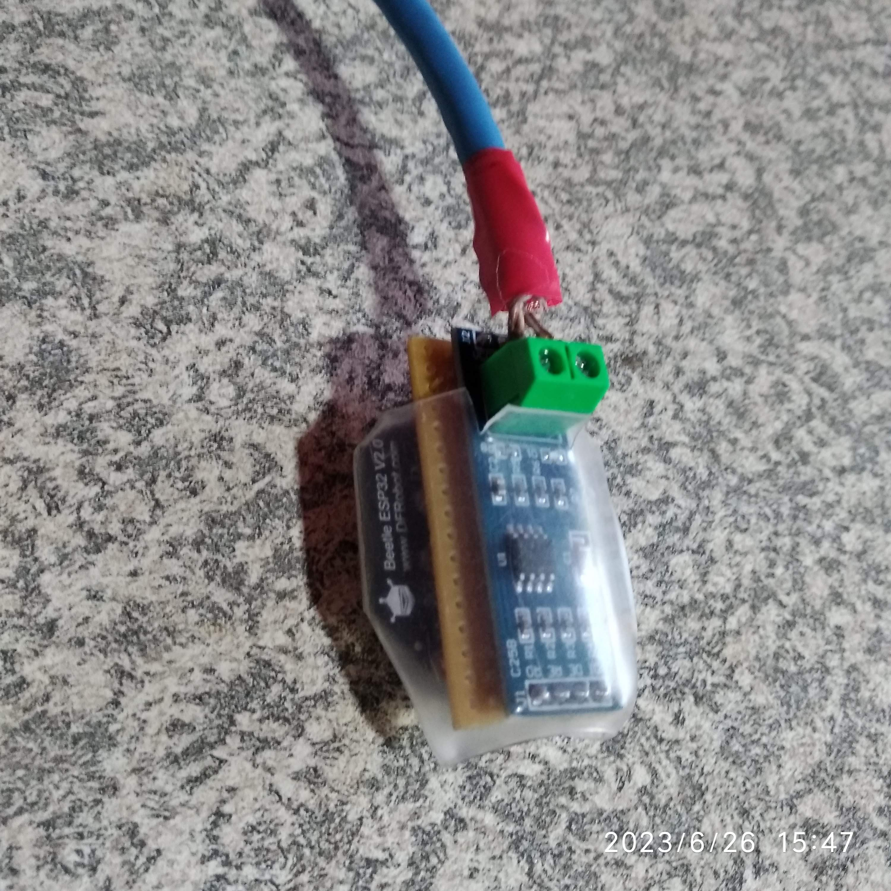

The smartDeyeDongle contains all the decoding logic for the inverter and will give you a seamless integration into Home Assistant and the DeyeSolarDesktop

### What you need to have already:
* You need to be running a 5kW/8kW/16kW single phase Deye/Sunsynk inverter.
(Master/Slave & 3Phase not currently supported, Split still in planning phase) (will be released once tested)
* You need to run your own home assistant (https://www.home-assistant.io/installation/) on an old PC/VM/Laptop/Rasp Pi or similar must support 64bit.
* You need to have a 2.4GHz wifi network at the inverter with reasonable network coverage.

#### Not included (must supply your own):
* You need to have an old micro-USB (type B  )   phone charger to supply power, even if it is a slo-o-o-ow charger, 500mA it is fine. These are still common even today for most electronic devices

### Cost
Price=ZAR 700 (EFT) + Courier( ZAR 100)/You collect(free)  
Comes with RJ45 network cable (30cm)  that has been plugged into an inverter and verified to be working without issues. Also protected with a heat-shrink cover.
Shipping R100 via The Courier Guy (3-4 business days economy, but most of the times they deliver the next day) Only available in South Africa for now

Plug and play device for home assistant that allows most settings on the inverter to be changed via UI/automations.

You can contact me on this Thread/Forum
https://powerforum.co.za/topic/20185-deyesmartdongle-for-5kw8kw16kw-single-phase-deyesunsynk-inverter-available-for-order/
